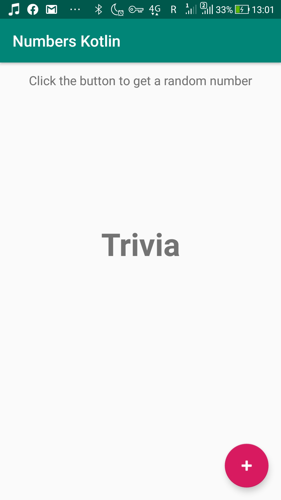
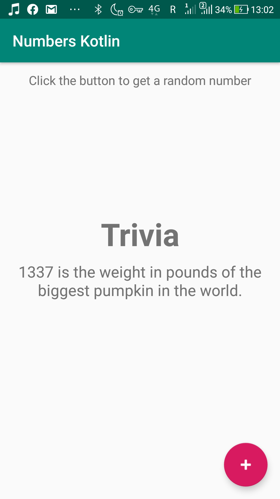
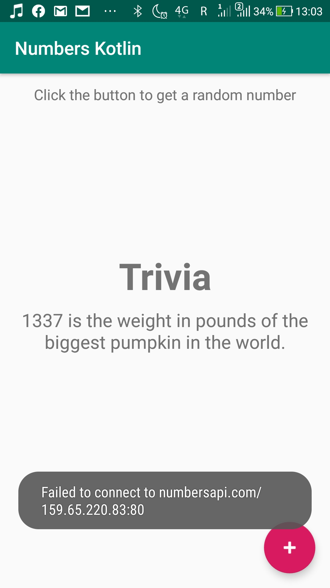

# Level 6 Example - Number Trivia Kotlin
This is an app based on http://numbersapi.com where a random number is displayed with a fact about that number. 
## What's inside
The only new subject covered in this learning task was this one:
* Connect to a REST api using Retrofit
Retrofit turns an HTTP API into a Java (Kotlin) interface.
The numbersapi itself works pretty bad and for some reason is not available from a Russian IP address (see the third screenshot).
## Screenshots
    

